# Group Brainstorming Session Summary

## Case Prompt
> "Propose a solution that reduces customer friction in shared domains while preserving the speed, autonomy, and innovation that Home Depot's decentralized model enables. Your recommendation must address how AI can transform redundancy rates from a static, product-level signal into a dynamic, system-level coordination mechanism. Be specific about governance changes, shared metrics, and coordination mechanisms you would implement."

---

## Today's Goals (from whiteboard)
- [ ] Finalized Problem Statement
- [ ] Brainstorm Solutions MECE
- [ ] Make Official Recommendation
- [ ] Review Yesterday's Analysis
- [ ] Draw Company Org Chart
- [ ] Start Implementation Map

### Sub-notes:
- Complete AI de-integration
- Inventory as digital products
- Meeting b/t all dig product teams
- Pause on AI till organized
- Humans > AI - associates online
- Plan to meet with associate (appointment/pickup)

---

## Solutions Brainstormed

### Initial Ideas
- **Rover?** - unclear/tabled
- **Re-design Website** ✓ (approved)
- **Acquire 3rd-party AI agent**
- **Digital Product Coordination/Integration** - roles or cross-functional team
- **Make cohesion layer a person/team**
- **Apron is MAIN FOCUS!**
- **Google-esque** → Y/N or bypass option
- **Two Journey positions** - DIY/Pro

### Top Recommendations (Best Recs)
1. **Dual purpose search engine**
   - More AI focus
   - Split into Pro/DIY sections
2. **Re-org → last step** (not first priority)
3. **Optimize KPIs under VP Online**
   - Regular meetings
   - "Show me the incentives, I'll show you the outcomes" - Warren Buffett
4. **Proper inventory alignment KPI**
   - Cross-check inventory with store records
5. **AI → Appointment → Order ahead → Fulfilled with Associates**
   - Keeps the associate expert feel
6. **Reinforcement Learning**
   - Using improvement over time
   - Associate has to review Magic Apron's job
7. **Two journey positions (DIY & Pro)**

### Key Insight
> "Website is basically Magic Apron" - segmented into DIY and Pro experiences

---

## Two-Pronged Approach (Refined)

### Prong 1: Dual-Purpose Search Engine
- Separated into "DIY" & "Pro" sections
- AI-driven appointment features where customers can meet with a Pro in-store
- Reinforcement Learning using rating system to improve AI recommendations over time
- Go with the associate or have them pull the order?

### Prong 2: Company Reorganization
- **Create a VP of DIY Customer** focused on optimizing customer experience online + in-store
- **Bi-weekly meetings** between representatives of each digital product team to promote collaboration and avoid redundancies
- **Monthly meetings** between VPs of Pro, DIY, and Online to ensure product development aligns with customer experience
- **Create new OKRs/KPIs** designed to optimize customer experience
- Move _____ department to ______ (TBD)

---

## Final Recommendation Draft

> We recommend that Home Depot pursue a two-pronged approach that emphasizes a dual-purpose, AI-enabled search engine optimized for both [DIY and Pro customers] to tightly align digital product development with the end-to-end customer experience.

---

## Key Problems Identified
1. Eroding customer trust
2. Reducing fragmentation
3. Creating capability acceptance rate

---

## Proposed Organizational Structure

### Current Structure (from whiteboard)

```mermaid
graph TD
    CEO[CEO]

    CEO --> EVP_DP["EVP Digital Products<br/>(Sam)"]
    CEO --> EVP_IT["EVP CIO IT"]
    CEO --> EVP_Pro["EVP Pro Customer"]

    %% Digital Products branch
    EVP_DP --> VP_DS["VP Data Science"]
    EVP_DP --> VP_Del["VP Delivery<br/>(Dave)"]
    EVP_DP --> VP_Online["VP Online"]

    %% VP Online's teams
    VP_Online --> MA["Magic Apron"]
    VP_Online --> OC["Order Completion"]
    VP_Online --> Rec["Recommendations"]
    VP_Online --> Search["Search"]
    VP_Online --> Mobile["Mobile App"]
    VP_Online --> OAM["Orange Apron Media<br/>(Sponsored Ads)"]

    %% IT branch
    EVP_IT --> VP_IT["VP IT"]
    VP_IT --> Doug["Daug doc team"]

    %% Pro Customer branch
    EVP_Pro --> VP_Pro["VP Pro"]
    EVP_Pro --> VP_DIY["VP DIY<br/>🆕 PROPOSED"]

    VP_Pro --> ProExp["Pro Experience"]
    VP_DIY --> DIYExp["DIY Experience<br/>🆕"]

    %% Relationships between teams
    OC -.->|"competes w/"| Rec
    Rec -.->|"relies on"| Search
    OAM -.->|"impacts"| ProExp

    %% Styling
    style VP_DIY fill:#ff6b6b,stroke:#c92a2a,color:#fff
    style DIYExp fill:#ff8787,stroke:#c92a2a,color:#fff
    style MA fill:#ffd43b,stroke:#fab005
    style OC fill:#ffd43b,stroke:#fab005
    style Rec fill:#ffd43b,stroke:#fab005
```

### Key Relationships Identified
- **Recommendations** relies on **Search**
- **Order Completion** competes with **Recommendations**
- Multiple teams **impact** Pro Experience
- Note on whiteboard: "talk to each other" between Order Completion and Recommendations

### Decisions (from whiteboard - green text)
- **DIY or Pro?** → Answer: Both, with dedicated journey positions
- **"Describe what you're doing"** → Creating customer-journey ownership

### Proposed Change: VP DIY
- Reports to: EVP Pro Customer
- Owns: DIY Experience (DIY EXP)
- Mirror structure to VP Pro
- Creates customer-journey ownership for DIY segment

### Open Questions from Org Discussion
- Where does VP DIY sit exactly? (Under EVP Pro Customer shown, but could argue for own EVP)
- How do Magic Apron and DIY Experience interact?
- Does VP Online's scope shrink or does DIY EXP pull from multiple existing teams?

---

## Notes for Refinement
- Re-org should be last step, not first
- Focus on Magic Apron as the centerpiece
- Need to fill in: "Move _____ department to ______"
- m = business team notation
