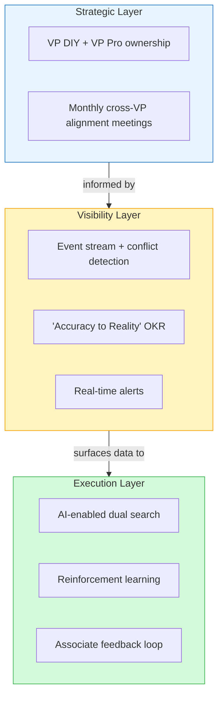

# Comparison: Group Position vs. Visibility Layer Proposal

## Solution Overview

| Aspect | Group Position | Our Visibility Layer |
|--------|---------------|---------------------|
| **Core approach** | Two-pronged: AI search + reorg | Technical layer + shared OKR |
| **Primary mechanism** | Customer journey ownership | Event-based conflict detection |
| **AI role** | Customer-facing (search/appointments) | Backend (pattern detection) |
| **Governance change** | Add VP DIY position | Add shared "Accuracy to Reality" metric |
| **Coordination** | Bi-weekly/monthly meetings | Real-time automated alerts |

---

## Where We Align

### 1. Recognition of Fragmentation Problem
Both solutions identify siloed digital product teams as the root cause of customer friction.

### 2. Need for Cross-Team Coordination
- Group: Regular meetings between digital product teams
- Ours: Event stream creates passive coordination via visibility

### 3. KPI/Metric Reform
- Group: "Create new OKRs/KPIs designed to optimize customer experience"
- Ours: "Accuracy to Reality" shared OKR

### 4. Preserving Decentralization
Both explicitly avoid centralizing all decision-making power.

---

## Where We Differ

### The "How" of Coordination

| Group's Approach | Our Approach |
|-----------------|--------------|
| Meetings (human coordination) | Automated event stream (system coordination) |
| Organizational restructuring | Technical infrastructure |
| Heavy upfront change | Lightweight additive layer |
| Proactive (design alignment) | Reactive (conflict detection) |

### AI Usage

| Group | Ours |
|-------|------|
| Customer-facing AI (dual search engine, appointments) | Backend AI (process mining, pattern detection) |
| Reinforcement learning from associate ratings | Async batch analysis of event patterns |
| More visible to customer | Invisible to customer |

### Risk Profile

| Group | Ours |
|-------|------|
| Higher political risk (reorg touches turf) | Lower political risk (additive, not reshuffling) |
| Lower technical risk (meetings are simple) | Moderate technical complexity |
| Longer to implement fully | Can MVP in 4-6 weeks |

---

## Potential Refutation Points

### Against Group's Position

1. **Meetings don't scale**
   - Bi-weekly meetings across 6+ teams = scheduling nightmare
   - Async conflicts happen in milliseconds; meetings happen weekly
   - "Who decides when VP Pro and VP DIY disagree?"

2. **Reorg is politically risky**
   - Case explicitly states decentralization is valued
   - Adding VP DIY under EVP Pro Customer creates territorial tension
   - "Why does Pro own DIY? Why not the other way?"

3. **Search engine doesn't address root cause**
   - Better search UX doesn't fix inventory/pricing mismatches
   - Magic Apron already exists — another search tool adds complexity
   - "You're adding a bandaid on top of the symptom"

4. **No clear metric for success**
   - Group says "create new KPIs" but doesn't specify what
   - How do you measure if meetings are working?
   - "What gets measured gets managed" — they haven't defined the measurement

### Against Our Position (Anticipate Their Pushback)

1. **"This is too technical/not strategic enough"**
   - Rebuttal: Technical solution enables strategic visibility without turf wars

2. **"Where's the customer experience improvement?"**
   - Rebuttal: Fixing inventory/price mismatches IS the CX improvement

3. **"You're not addressing search fragmentation"**
   - Rebuttal: Our layer can surface search conflicts too (add Search team to event stream)

4. **"You still need governance for conflict resolution"**
   - Rebuttal: True — but our layer tells you WHAT to resolve; meetings without data are blind

---

## Synthesis Opportunity

These approaches could complement each other:

**The pitch:** "Reorg without visibility is flying blind. Visibility without ownership is just dashboards no one acts on. You need both."

---

## Questions to Ask the Group

1. What happens when VP DIY and VP Pro want opposite things from the same product (e.g., lumber)?
2. How will you measure if the bi-weekly meetings are reducing friction?
3. Who decides if Magic Apron's recommendation conflicts with Search's?
4. What's the MVP? Can you test the reorg before fully committing?
